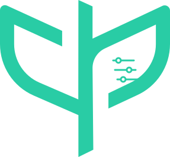

<p align="center">
  
</p>

# AgriTune

[](LICENSE.md)
[](https://pypi.org/project/pai-agritune/)
[](https://pypi.org/project/pai-agritune/)

---

Train and evaluate agricultural segmentation decoders on frozen features from a remote ViT encoder, with reproducible offline feature generation and optional rate-limit-aware online feature extraction.

AgriTune never trains or fine-tunes the encoder itself — it consumes features from a hosted embedding API (see [Encoder](#encoder)) and trains lightweight decoders on top of them. The one architectural rule the whole codebase protects:

> **Trainer and decoder never call the encoder API directly.** Everything goes through a `FeatureProvider` (cached, online, or hybrid), which is the only thing that talks to the `EncoderGateway`.

```text
Dataset → Augmentation → FeatureProvider → EncoderFeatures → SegmentationTask → Decoder → Loss/Metrics → Trainer
```

Coding standards, naming conventions, and tooling configuration are governed by [CLAUDE.md](CLAUDE.md). See [agritune_implementation_plan.md](agritune_implementation_plan.md) for the full phased build-out this repository follows.

---

## Status

This repository is under active build-out following the phased plan in [agritune_implementation_plan.md](agritune_implementation_plan.md). The `v0.1.0` target ("first usable release") — offline/no augmentation → remote encoder precomputation → local feature store → linear + TokenFPN decoders → AdamW + cosine schedule → AMP + gradient accumulation → checkpoint/resume → mIoU/Dice metrics → JSONL + TensorBoard tracking → a fully reproducible run directory — is complete. Most of `v0.2` has landed too: `OnlineFeatureProvider`/`HybridFeatureProvider`, a background-thread prefetch queue that overlaps encoding with training, `augmentation.mode: hybrid`, feature-space augmentation, an albumentations-based augmentation engine with agricultural domain-specific transforms, and a thin FastAPI layer alongside the CLI. Configuration now composes via Hydra/OmegaConf config groups (`dataset`, `encoder`, `augmentation`, `feature_provider`, `task`, `decoder`, `optimizer`, `scheduler`, `tracking`), and the decoder lineup has grown to six: `mlp_probe`, `token_fpn`, `aspp`, `ppm`, `segmenter`, and `mask_former`. Distributed (multi-GPU) training remains `v0.3`.

---

## Installation

```bash
python -m venv .venv
source .venv/bin/activate      # Windows: .venv\Scripts\activate

# Runtime only
pip install -r requirements.txt

# Full development (tests, pre-commit, type checking)
pip install -e ".[dev]"
pre-commit install
```

Optional tracking backends (TensorBoard/MLflow/W&B/Neptune/Comet) are not required for training and are installed separately:

```bash
pip install -e ".[tracking]"
```

---

## CLI

```bash
agritune --help
```

```bash
agritune config init           # write a fully-commented training config template to edit

agritune dataset init          # write an example manifest CSV (placeholder rows) to edit
agritune dataset validate      # missing files, duplicate IDs, invalid labels, dimension mismatch
agritune dataset inspect       # dataset statistics

agritune encoder benchmark     # empirical batch size / concurrency recommendations

agritune features build        # resumable offline feature precomputation
agritune features verify       # checksum verification
agritune features inspect      # store statistics
agritune features clean        # remove orphaned tensor/meta files

agritune train
agritune evaluate
agritune predict                # --overlays writes a colorized prediction overlay per sample
```

The CLI, the FastAPI layer (`precisionai.agritune.api.create_app()`, one route per command above except `config init`/`dataset init`, local file-scaffolding utilities with no server-side equivalent), and direct Python usage all call the same `precisionai.agritune.services.*` functions — no logic is duplicated between entry points.

---

## Encoder

AgriTune's remote encoder backend integrates with an OpenAI-SDK-compatible embeddings API (see `precisionai.agritune.encoder`): the CLS token is returned as the embedding vector, and patch tokens are returned via the `patch_embeddings` (channels-first `[D, H, W]`, base64 float32) and `patch_shape` fields of the response — enabled per-request with `extra_body={"return_patch_tokens": True}`. The API does not expose a queryable encoder revision, so AgriTune fingerprints the encoder from the configured model alias plus the dimensions actually observed at runtime — see [docs/encoder.md](docs/encoder.md).

Nothing in the training path depends on this specific API being reachable: CI, and any offline development, run entirely against `FakeEncoderBackend`.

---

## Project layout

```
precisionai/agritune/
  api/            # thin FastAPI layer — delegates to services/
  augmentations/  # image/ (geometric+photometric) and feature/ (patch dropout etc.) transforms
  cli/            # `agritune` entry point and subcommands
  configs/        # Hydra config groups (dataset, encoder, augmentation, feature_provider, task, decoder, ...)
  data/           # dataset adapters, manifests, split strategies
  encoder/        # EncoderBackend protocol, FakeEncoderBackend, RemoteEncoderBackend, gateway, rate limiter
  features/       # FeatureProvider (cached/online/hybrid/prefetching), FeatureStore, cache keys, resumable precomputation
  logging/        # configure_logging (stderr), secret redaction, progress bars, run provenance
  metrics/        # pure computation (segmentation metrics, etc.)
  optimization/   # optimizer/scheduler registries
  schemas/        # EncoderFeatures, Sample, PreparedSample, and core protocols
  services/       # orchestration used by both the CLI and the API
  tasks/segmentation/decoders/   # MLP probe, TokenFPN, ASPP, pyramid pooling, Segmenter, MaskFormer
  tracking/       # Tracker protocol + JSONL/TensorBoard/MLflow/W&B/Neptune/Comet backends
  training/       # Trainer, evaluator, checkpointing, distributed
  utils/
docs/             # Sphinx (HTML + LaTeX/PDF) plus architecture/config/dataset/etc. guides
tests/            # unit/, integration/, distributed/, fixtures/
examples/         # runnable config examples (segmentation/*.yaml) and dataset samples
```

See [CLAUDE.md](CLAUDE.md) for the full coding standard covering imports, docstrings, type hints, testing, and what to avoid.

---

## Testing

```bash
python -m pytest                              # run all tests with coverage report
pytest -m "not integration and not distributed"  # unit tests only (what CI/pre-commit run)
pytest -k "cache"                             # tests matching a keyword
```

Coverage must remain at or above **90%** — enforced by pytest and the pre-commit hook. No unit test requires a live encoder API key; the fake encoder backend covers 429/500/timeout/malformed-response scenarios.

---

## Pre-commit hooks

| Hook | What it checks |
|---|---|
| File hygiene | Large files (> 1800 KB), trailing whitespace, merge conflicts, private keys, debug statements, BOM removal |
| `ruff` | Linting and import sorting (auto-fix) |
| `ruff-format` | Code formatting (auto-fix) |
| `pyright` | Static type checking |
| `pytest` | Full test suite with ≥ 90% coverage (integration/distributed excluded) |

Run all hooks manually without committing:

```bash
pre-commit run --all-files
```

---

## Documentation

```bash
cd docs
make html       # HTML docs → docs/_build/html/index.html
make latexpdf   # PDF      → docs/_build/latex/documentation.pdf
make clean      # Remove build artefacts
```

Dependencies: `pip install -r docs/requirements.txt`

---

## Releasing

Push a tag matching `v*.*.*` (e.g. `v0.1.0`) to trigger `.github/workflows/release.yml`, which runs the test suite, builds the sdist/wheel, publishes to PyPI via trusted publishing, and creates a GitHub Release. The package version is derived from the git tag via `setuptools-scm` — update `CHANGELOG.md` before tagging.

---

## Security

To report a security vulnerability, see [SECURITY.md](SECURITY.md). Do not open a public issue, and never include encoder API keys in a report, log, or attached reproduction.

---

## Contributing

See [CONTRIBUTING.md](CONTRIBUTING.md) for setup, branching, and PR guidelines, and [CODE_OF_CONDUCT.md](CODE_OF_CONDUCT.md) for community expectations. [CLAUDE.md](CLAUDE.md) documents the code style and conventions enforced in this repo.

---

## License

[Apache 2.0](LICENSE.md) © Precision AI
